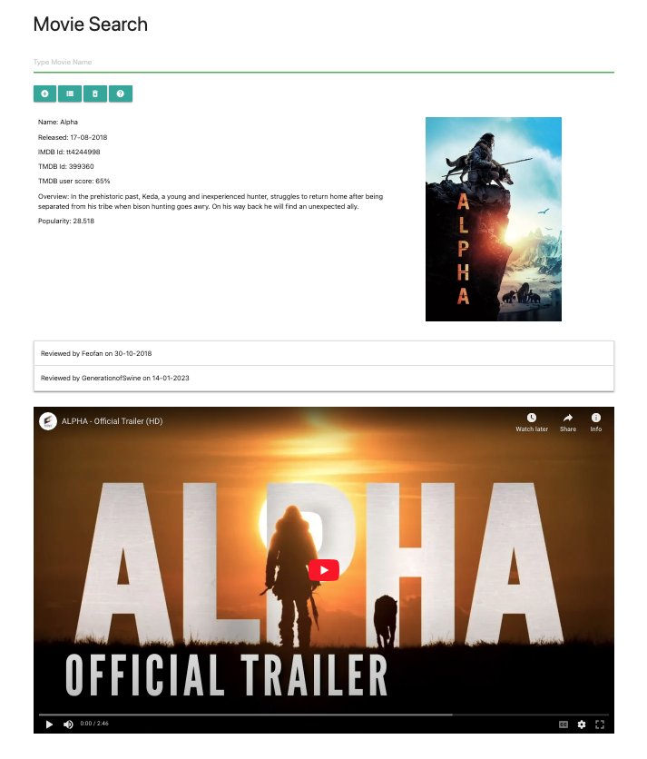

# Movie Search

## Description
Movie Search lets users search the TMDB database for information about movies and display it on an easy to use web page. Users can save their favourite movies to local storage for quick access in later sessions.

Initially the web page will only display some of the information that is available to the APIs. Each type of information requires its own API call and this increases complexity and development time.

Movie Search as built is considered the minimum viable product.

## Movie Search Link
Click the link to visit the deployed website: [Movie Search][def1].



## Navigation

Movie Search is easy to use and navigate.

The web page has a single input field for a Movie Name be entered. There is PlaceHolder text to give a hint.

There are 6 buttons but they are not all visible at once. If a button is visible it can be used.

1. Search - visible when the Search Bar has focus
2. Add To Favourites - visible when the displayed movie is not a favourite
3. Delete From Favourites - visible when the current movie is a favourite
4. View Favourites - visible when there is a least one movie is a favourite
5. Clear Favourites - visible when there is a least one movie is a favourite
6. Help - Visible all the time - displays a brief description of the buttons

All buttons have tool tips as a quick guide.

## Technologies
Movie Search will use the following technologies:
1. HTML - for page layout
2. CSS - page styling
3. JavaScript - coding
4. jQuery - a JavaScript library to handle DOM traversal & manipulation & event handling 
5. Dayjs - a JavaScript library to simplify date manipulation
6. Materialize - CSS framework
7. OMDB API - access the The Open Movie Datbase using API calls and retrieve movie related data 
8. TMDB API - access the The Movie Datbase using API calls and retrieve movie related data
9. YouTube IFrame pleyer API 

## Folder Structure
```
├── assets
│   ├── css
│   │   ├── style.css
│   │
│   ├── js
│       ├── script.js  
│
│   │
│   ├── images
│       ├── movieSearch.png 
│
├── index.html
├── README.md
├── DOCO.md
├── CODEBASE.md 
└── .gitignore
```

## Design
Read the Movie Search [Design Document](./DESIGN.md)   

## Test Plan
Read the Movie Search [Test Plan](./TESTPLAN.md) 

## Implementation

### HTML
Movie Search will be a simple index.html web page containing:
1. Header Row - Page Title
2. Search Bar - Input Field
3. Button Bar - Search, Add to Favourites, Del from Favourites, View Favourites & Clear Favourites buttons 
4. Content Area comprising 4 panels
    1. Panel 1 holds movie data
    2. Panel 2 holds the movie poster
    3. Panel 3 holds movie reviews
    4. Panel 4 holds a movie trailer (if available)
5. Modal - the modal will list movie hits, favourites list and error messages

### CSS
Most CSS will be handled by Materialize.

Custom modifications will be in styles.css. These might be to adjust button layouts & display properties

### JavaScript
The JavaScript code controls the way Movie Search works.

Movie Search code will be driven by Button Clicks. Button visibility will be controlled by data. The presence or absence of data will control which buttons are visible and can be clicked.

## Resources Used
1. Bootcamp Materials - Lesson Material from Week 6
2. Prior knowlege and experience
3. Group tutorial sessions
4. [jQuery ][def5] jQuery API Documentation
5. [Day.js][def6] Day.js Documentation
6. [MDM Web Docs][def7] Array.prototype.findindex()
7. [MDM Web Docs][def8] Array.prototype.includes()
8. [MDM Web Docs][def9] Array.prototype.splice()
9. [MDM Web Docs][def10] Arrow function expressions
10. [Open Movie Database API][def2] Documentation
11. [The Movie Database API][def3] Documentation
12. [YouTube IFrame Player API][def11] Documentation
13. [Materialize][def4] Documentation


[def1]: https://dingogap.github.io/moviesearch/
[def2]: https://www.omdbapi.com/
[def3]: https://developer.themoviedb.org/reference/intro/getting-started
[def4]: https://materializecss.com/
[def5]: https://jquery.com/
[def6]: https://day.js.org/en/
[def7]: https://developer.mozilla.org/en-US/docs/Web/JavaScript/Reference/Global_Objects/Array/findIndex
[def8]: https://developer.mozilla.org/en-US/docs/Web/JavaScript/Reference/Global_Objects/Array/includes
[def9]: https://developer.mozilla.org/en-US/docs/Web/JavaScript/Reference/Global_Objects/Array/splice
[def10]:https://developer.mozilla.org/en-US/docs/Web/JavaScript/Reference/Functions/Arrow_functions
[def11]: https://developers.google.com/youtube/iframe_api_reference


